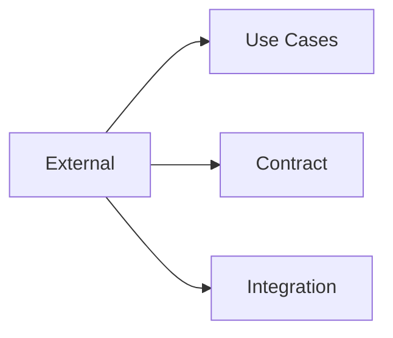

[Home](/) > [Docs](/docs/readme.md) > External

# Pillar: External

System boundaries, API contracts, and third-party behavioral expectations.



## Sub-directories
- [use-cases.md](use-cases.md): Primary operational contexts for repository consumption.
- [contract/](contract/): OpenAPI, GraphQL, and public interface definitions.
- [integration/](integration/): SLAs and behavior for 3rd party vendors.

---
## Machine Navigation Metadata
```yaml
type: directory_manifest
pillar: external
index_map:
  use_cases:
    path: use-cases.md
    scope: Primary repository consumption contexts.
  contract:
    path: contract/
    scope: Public API definitions.
  integration:
    path: integration/
    scope: Vendor SLAs and behavioral specs.
```

