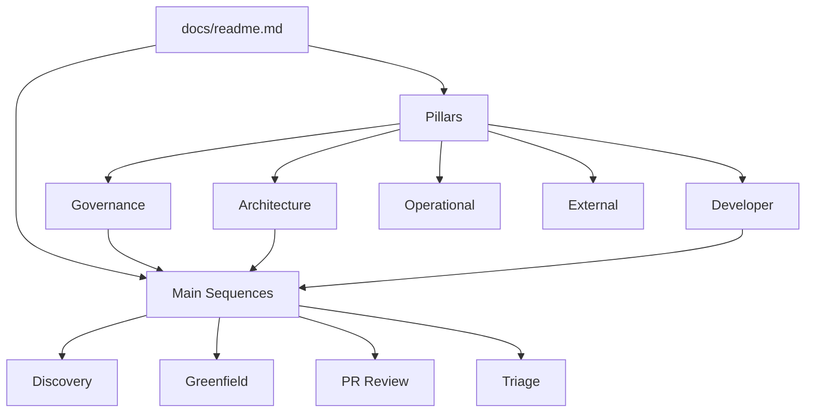

[Home](/) > Docs

# Documentation Pillars

This repository uses a Documentation-as-Code (DaC) model to govern all repository operations and code standards.

## Main Sequences
The definitive entry points for any repository action.
- **[Discovery](/docs/governance/protocol/discovery.md):** Map and ingest code shapes.
- **[Greenfield](/docs/governance/protocol/greenfield.md):** Implement new features.
- **[PR Review](/docs/governance/protocol/pull-request-review.md):** Mandatory change verification.
- **[Triage](/docs/governance/protocol/operational-triage.md):** Active incident response.

## Pillars

- **[Governance](/docs/governance/readme.md)**: Meta-rules, operational protocols, and architectural constraints.
- **[Architecture](/docs/architecture/readme.md)**: System topology, capabilities (T2), and module (T3) definitions.
- **[Developer](/docs/developer/readme.md)**: Code patterns, implementation standards, and SDLC workflows.
- **[Operational](/docs/operational/readme.md)**: Runbooks, deployment procedures, and observability spans.
- **[External](/docs/external/readme.md)**: Interaction contracts and API definitions for external consumers.
