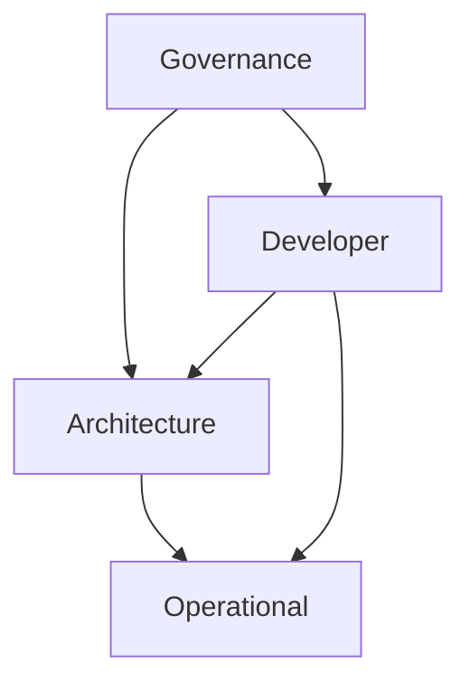

# Repository Root & Knowledge Graph

This repository is governed by an AI-native, RAG-optimized documentation architecture (Documentation-as-Code).



## Protocol & Governance (`docs/governance/`)
*Nuance: Meta-rules, operational protocols, and architectural constraints. This is the entry point for all agentic and human modifications.*
- [Protocol](docs/governance/protocol/): Step-by-step execution scripts for project sequences (Greenfield, Discovery, PR Review).
- [Standard](docs/governance/standard/): Global constraints and pattern ratings (PADU) for structural compliance.

## Topology & Capabilities (`docs/architecture/`)
*Nuance: System topology, capabilities (T2), and module (T3) definitions. Defines the hierarchical map of the codebase.*
- [Capability](docs/architecture/capability/): Bounded contexts orchestrating multiple modules to deliver business value.
- [Module](docs/architecture/module/): Physical code clusters mapping implementation to architectural requirements.

## Shapes & Workflows (`docs/developer/`)
*Nuance: The "How-To" for building and maintaining the system. Contains contextless shapes and human-centric workflows.*
- [Pattern](docs/developer/pattern/): Atomic definitions of code geometry and document structures.
- [Workflow](docs/developer/workflow/): Human-centric guides for the SDLC (Getting Started, Git procedures).

## Recovery & Reliability (`docs/operational/`)
*Nuance: Artifacts for system uptime, incident restoration, and automated maintenance.*
- [Runbook](docs/operational/runbook/): Incident response flows mapping telemetry symptoms to resolutions.
- [Task](docs/operational/task/): Atomic, idempotent commands for health verification and recovery.

## Contracts & Boundaries (`docs/external/`)
*Nuance: API contracts and behavioral expectations for external consumers and vendor dependencies.*
- [Contract](docs/external/contract/): Public interface definitions (OpenAPI, GraphQL).
- [Integration](docs/external/integration/): Vendor SLAs and 3rd party interaction rules.

---
## Machine Navigation Metadata
```yaml
type: directory_manifest
pillar: root
index_map:
  governance:
    path: docs/governance/
    scope: Meta-rules and entry points.
  architecture:
    path: docs/architecture/
    scope: Topology and capabilities.
  developer:
    path: docs/developer/
    scope: Patterns and human workflows.
  operational:
    path: docs/operational/
    scope: Runbooks and restoration tasks.
  external:
    path: docs/external/
    scope: API contracts and vendor SLAs.
```
